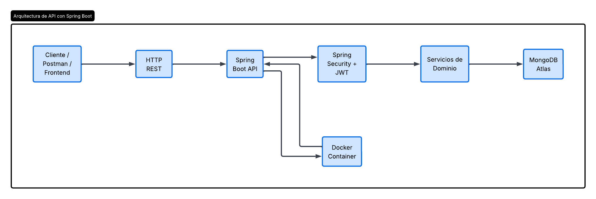
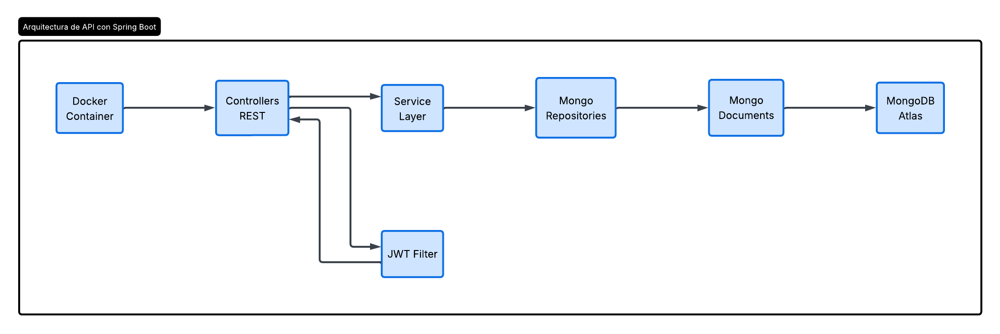
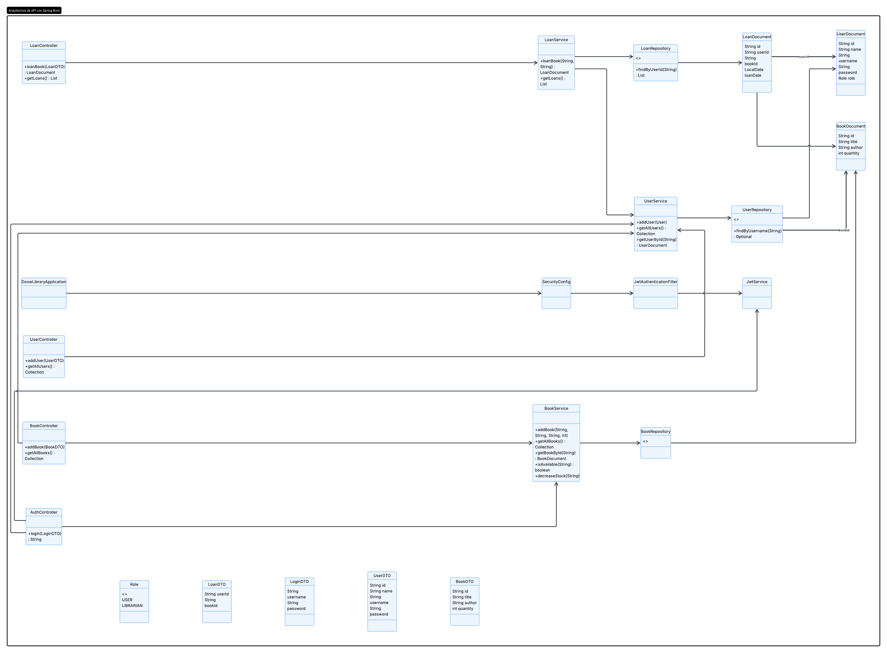

# DOSW-Library
## Biblioteca API

El proyecto implementa una API REST para la gestión de una biblioteca.
El sistema permite administrar usuarios, libros y préstamos, aplicando
reglas de negocio como disponibilidad de libros y manejo de errores.

La aplicación está desarrollada con Spring Boot y sigue una arquitectura
por capas (controller, service, model).

## Arquitectura

El sistema sigue una arquitectura por capas:

- **Controller**: Expone los endpoints REST.
- **Service**: Contiene la lógica de negocio.
- **Model**: Representa las entidades del dominio.
- **DTO**: Objetos de transferencia de datos.
- **Exception**: Manejo centralizado de errores.
- **Util**: Validaciones y utilidades de apoyo.

## Diagramas

### Diagrama General

### Diagrama Específico

### Diagrama de Clases

## Documentación de la API
